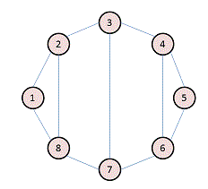
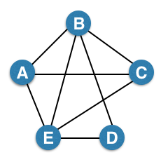

# Question 1:

For the following graph:

There are eight nodes, named 1 through 8.  Each node has an edge to the next-higher-numbered node, and there is also an edge between 1 and 8.  In addition, there are edges between 2 and 8, between 3 and 7, and between 4 and 6.

Write the adjacency matrix A, the degree matrix D, and the Laplacian matrix L. For each, find the sum of all entries and the number of nonzero entries. Then identify the true statement from the list below.

**Resp:** L has 30 nonzero entries.

# Question 2:

Consider the following undirected graph (i.e., edges may be considered bidirectional):

There are 5 nodes named A through E.  There is an edge between every pair of nodes except for the pair (C,D).

Run the "trawling" algorithm for finding dense communities on this graph and find all complete bipartite subgraphs of types K3,2 and K2,2. Note: In the case of K2,2, we consider {{W, X}, {Y, Z}} and {{Y, Z}, {W, X}} to be identical.

**Resp:** {{A, C, D}, {B, E}} is an instance of K<3,2>

# Question 3:

We fit AGM to the network on the left, and found the parameters on the right:

The network on the left has ten nodes, which we shall refer to as 1 through 10.  There are edges between the following sixteen pairs: 1-2, 1-3, 1-4, 2-3, 3-4, 2-5, 4-5, 5-7, 5-6, 5-10, 6-7, 7-8, 6-8, 6-9, 8-9, and 9-10.  On the right side of the diagram are two trees with roots labeled A and B, and with associated probabilities pA and pB.  A has children 1, 2, 3, 4, and 5, while B has children 5, 6, 7, 8, 9, and 10.  Note that 5 is a child of both.

Find the optimal values for pA and pB. Then identify the correct value below.

**Resp:** pB = 0.6

# Question 1:

We wish to estimate the surprise number (2nd moment) of a data stream, using the method of AMS. It happens that our stream consists of ten different values, which we'll call 1, 2,..., 10, that cycle repeatedly. That is, at timestamps 1 through 10, the element of the stream equals the timestamp, at timestamps 11 through 20, the element is the timestamp minus 10, and so on. It is now timestamp 75, and a 5 has just been read from the stream. As a start, you should calculate the surprise number for this time.

For our estimate of the surprise number, we shall choose three timestamps at random, and estimate the surprise number from each, using the AMS approach (length of the stream times 2m-1, where m is the number of occurrences of the element of the stream at that timestamp, considering all times from that timestamp on, to the current time). Then, our estimate will be the median of the three resulting values.

You should discover the simple rules that determine the estimate derived from any given timestamp and from any set of three timestamps. Then, identify from the list below the set of three "random" timestamps that give the closest estimate.

**Resp:**

# Question 2:

Suppose we are using the DGIM algorithm of Section 4.6.2 to estimate the number of 1's in suffixes of a sliding window of length 40. The current timestamp is 100, and we have the following buckets stored:

| End Time | Size |
| -------- |:----:|
| 100      | 1    |
| 98       | 1    |
| 95       | 2    |
| 92       | 2    |
| 87       | 4    |
| 80       | 8    |
| 65       | 8    |

Note: we are showing timestamps as absolute values, rather than modulo the window size, as DGIM would do.

Suppose that at times 101 through 105, 1's appear in the stream. Compute the set of buckets that would exist in the system at time 105. Then identify one such bucket from the list below. Buckets are represented by pairs (end-time, size).

**Resp:**

# Question 3:

We wish to use the Flagolet-Martin algorithm of Section 4.4 to count the number of distinct elements in a stream. Suppose that there are ten possible elements, 1, 2,..., 10, that could appear in the stream, but only four of them have actually appeared. To make our estimate of the count of distinct elements, we hash each element to a 4-bit binary number. The element x is hashed to 3x + 7 (modulo 11). For example, element 8 hashes to 3x8+7 = 31, which is 9 modulo 11 (i.e., the remainder of 31/11 is 9). Thus, the 4-bit string for element 8 is 1001.

A set of four of the elements 1 through 10 could give an estimate that is exact (if the estimate is 4), or too high, or too low. You should figure out under what circumstances a set of four elements falls into each of those categories. Then, identify in the list below the set of four elements that gives the exactly correct estimate.

**Resp:**

# Question 4:

A certain Web mail service (like gmail, e.g.) has 108 users, and wishes to create a sample of data about these users, occupying 1010 bytes. Activity at the service can be viewed as a stream of elements, each of which is an email. The element contains the ID of the sender, which must be one of the 108 users of the service, and other information, e.g., the recipient(s), and contents of the message. The plan is to pick a subset of the users and collect in the 1010 bytes records of length 100 bytes about every email sent by the users in the selected set (and nothing about other users).

The method of Section 4.2.4 will be used. User ID's will be hashed to a bucket number, from 0 to 999,999. At all times, there will be a threshold t such that the 100-byte records for all the users whose ID's hash to t or less will be retained, and other users' records will not be retained. You may assume that each user generates emails at exactly the same rate as other users. As a function of n, the number of emails in the stream so far, what should the threshold t be in order that the selected records will not exceed the 1010 bytes available to store records? From the list below, identify the true statement about a value of n and its value of t.

**Resp:**

# Question 5:

Suppose we hash the elements of a set S having 23 members, to a bit array of length 100. The array is initially all-0's, and we set a bit to 1 whenever a member of S hashes to it. The hash function is random and uniform in its distribution. What is the expected fraction of 0's in the array after hashing? What is the expected fraction of 1's? You may assume that 100 is large enough that asymptotic limits are reached.

**Resp:**

